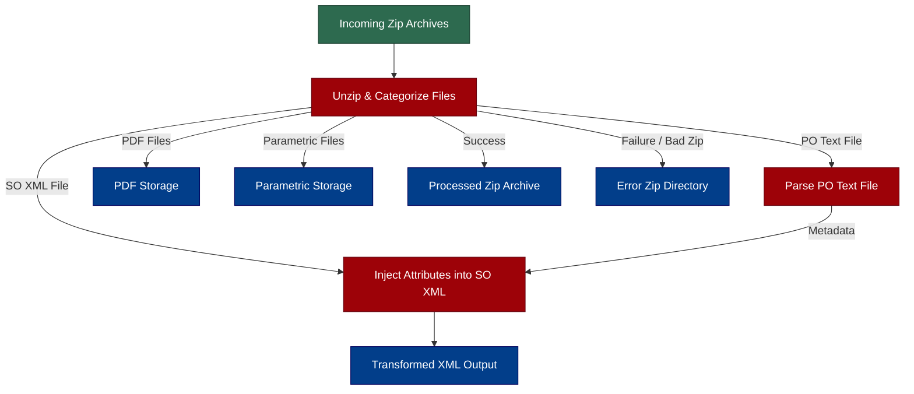

# File Fusion Software (MSI_CTO & SonaredCode)

A multi-format data management and file handling tool designed to extract, process, transform, and archive enterprise supply chain records (POSO tab-delimited files, SO XML documents, Parametric data, and PDF reports) from compressed archives.

---

## Overview

File Fusion Software automates the processing of complex supply chain archives containing Purchase Order (PO) tab-delimited records and Sales Order (SO) XML files[cite: 4]. It parses data from extracted PO files, enriches SO XML documents with dynamic elements, handles archival workflows, and generates daily execution logs[cite: 4].

**Category:** Data Processing & File Management[cite: 4]

---

## Functionality

* **Archive Extraction & Unzipping:** Automatically scans input directories, unpacks `.zip` archives, and processes internal files.
* **PO/SO Data Extraction:** Reads tab-delimited PO text files to extract metadata (e.g., PO Number, Supplier ID, Legal Entity, Priority).
* **XML Dynamic Processing:** Injects extracted PO metadata fields directly into Sales Order XML documents using DOM manipulation.
* **Multi-Format Document Archiving:** Automatically routes Parametric files, PDF reports, successfully processed zip archives, and corrupt/bad zip files into dedicated output directories.
* **Daily Logging & Execution Tracking:** Maintains detailed, daily timestamped log files (`log_yyyyMMdd.txt`) for audit trails and error diagnostics.

---

## Technical Specifications & Configuration

### Prerequisites
* **Java Development Kit (JDK):** Version 8, 11, or higher[cite: 4]
* **Core Java Libraries:** `javax.xml.parsers`, `javax.xml.transform`, `org.w3c.dom`, `java.util.zip`, `java.util.logging`

### Application Configuration Parameters

Configuration properties are loaded dynamically from localized `.properties` files at execution time.

| Argument Index   | Parameter Name         | Description                                                   |
|:-----------------|:-----------------------|:--------------------------------------------------------------|
| `file_paths[0]`  | `zip_InputPath`        | Directory containing incoming `.zip` archives                 |
| `file_paths[1]`  | `zip_ArchivePath`      | Archive destination for successfully processed `.zip` files   |
| `file_paths[2]`  | `output_SOFilePath`    | Output folder for transformed SO XML documents                |
| `file_paths[3]`  | `parametric_FilePath`  | Storage location for extracted Parametric files               |
| `file_paths[4]`  | `extract_POSOFilePath` | Temporary extraction directory for PO text files              |
| `file_paths[5]`  | `extract_SOFilePath`   | Temporary extraction directory for SO XML files               |
| `file_paths[6]`  | `pdf_FilePath`         | Storage location for extracted PDF documents                  |
| `file_paths[7]`  | `log_FilePath`         | Destination directory for system execution logs               |
| `file_paths[8]`  | `error_FilePath`       | Error folder for corrupted or invalid `.zip` archives         |
| `file_paths[9]`  | `file_loop_val`        | Maximum batch limit for zip archives per execution loop       |
| `file_paths[10]` | `input_file_name`      | File prefix pattern used to identify target PO and SO records |

---

## File Processing & Injected XML Schema

### Extracted PO Tab-Delimited Fields

| Index | Field Name      | Description                        |
|:------|:----------------|:-----------------------------------|
| `0`   | `PONUM`         | Purchase Order Identifier          |
| `2`   | `PO_STATE`      | State or region status of the PO   |
| `20`  | `SUPPLIER_ID`   | Supplier ID                        |
| `69`  | `PO_TYPE`       | Type of Purchase Order             |
| `71`  | `LEGAL_ENTITY`  | Registered legal entity identifier |
| `78`  | `PO_PRIORITY`   | Processing priority of the order   |
| `114` | `SHIP_METHOD`   | Shipping/Carrier method            |
| `137` | `SHIP_TO_SITE`  | Destination site location          |
| `183` | `SUPPLIER_SITE` | Supplier site identifier           |
| `219` | `REV_NUMBER`    | Revision number                    |

---

## Workflow Diagram

## Setup & Running Instructions

### Compile Java Source:

- Bash : javac sanm/MSI_CTO.java sanm/SonaredCode.java 
- Configure Property File: Ensure a .properties file exists in the execution directory containing key supplier mappings:

### Properties
- SUPPLIER_ID=SUPP001,SUPP002
- SUPP001=/path/to/input,/path/to/archive,/path/to/so_out,/path/to/para,/path/to/poso_tmp,/path/to/so_tmp,/path/to/pdf,/path/to/log,/path/to/err,10,B2B_PREFIX

### Execute Application:
Bash
java sanm.MSI_CTO